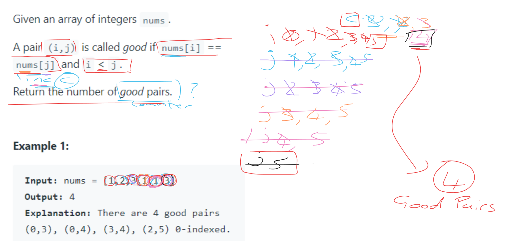
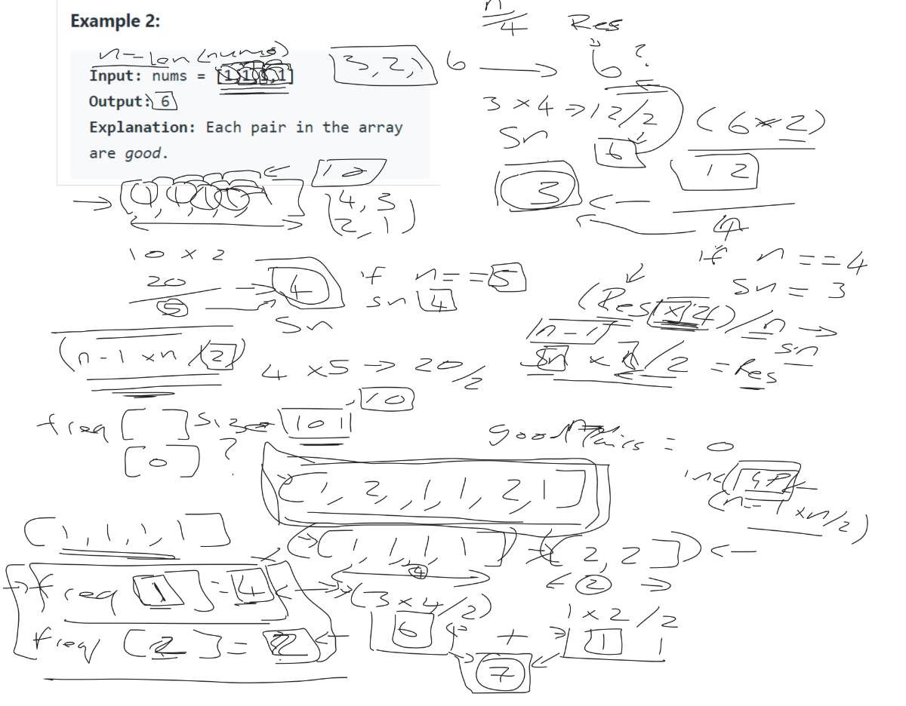

# Problem Solving Process
This repository will have the code from my YouTube videos about problem solving

## Number of Good Pairs
Given an array of integers nums.

A pair `(i,j)` is called good if `nums[i] == nums[j]` and `i < j`.

Return the number of good pairs.

### Example 1:

```
Input: nums = [1,2,3,1,1,3]
Output: 4
Explanation: There are 4 good pairs (0,3), (0,4), (3,4), (2,5) 0-indexed.
```

### Diagram

### Video
[](https://youtu.be/vAYxbu6AkH0)

### Example 2:
```
Input: nums = [1,1,1,1]
Output: 6
Explanation: Each pair in the array are good.
```

### Diagram


### Video
[](https://youtu.be/0JZYGtt3ZT0)

**Let me know what other problems would make for a good video to solve**
